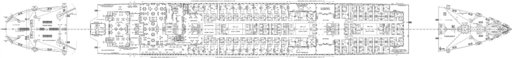
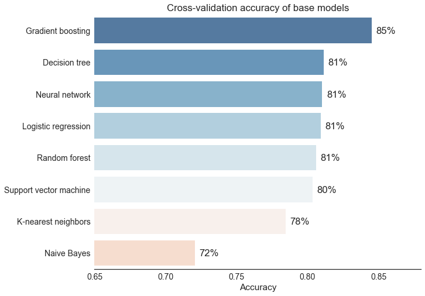
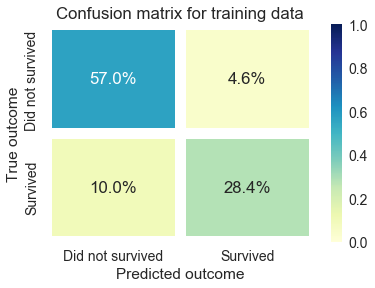
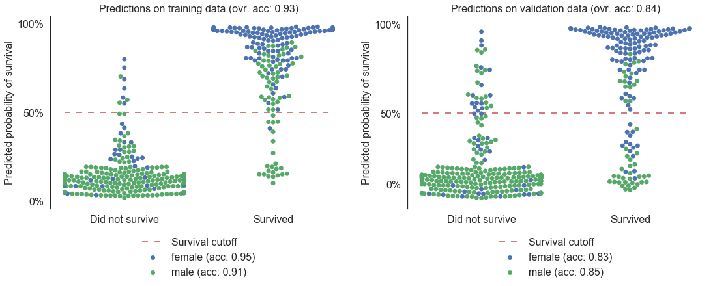
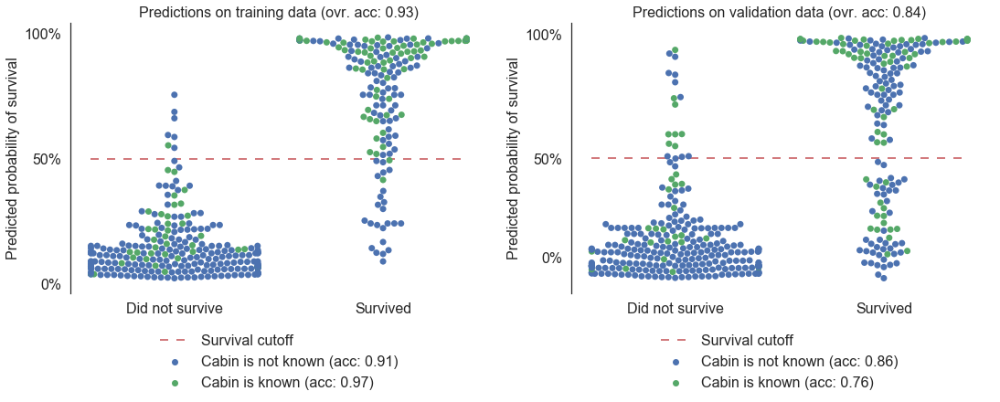

# Titanic: Machine Learning from Disaster

#### This notebook uses machine learning models to predict survivors on the Titanic with an accuracy of 80.8% on Kaggle's Titanic survivors competition (top 7% among Kaggle competitors)

## Introduction

The purpose of this project is to predict survivors on the Titanic using machine learning techniques based on training and testing data provided by Kaggle (https://www.kaggle.com/c/titanic).

## Description

The workflow for this project is the following:
- Importing train and test data files into pandas dataframes
- Feature engineering, including:
    - Merging both the train and test dataframes to detect common patterns
    - Adding new features: 
        - fraction of survivors among the group sharing the same ticket
        - fraction of survivors among sibblings (same last name and number of siblings)
        - flag if passenger's cabin is known (doubles the survival rate for 2nd and 3rd class passengers in the training data)
        - age categories ("Missing", "Infant", "Child", "Teenager", "Young Adult" ,"Adult" ,"Senior")
        - location of passenger's cabin (using publicly available deck maps of the Titanic), including:
           - deck (A to F)
           - position (forward, amidships or aft)
           - ship side (port or starboard)
           - distance to main staircases (near or far)
    - Filling "Age" column with best estimate data
        - average age of siblings (if available), or
        - average age of other passengers with same class and sex
    - Creating dummy variables for categorical variables (Sex, Embarked, Deck, etc.)
    - Normalization of features on a scale of 0 to 1
    - Separating the train and test dataframes again
- Quick analysis of the performance of various machine learning algorithms (Logistic regression, K-nearest , Decision tree, Random forest, Gradient boosting, Support vector machine, Naive Bayes model accuracy)
- Grid search for optimization of hyperparameters for the random forest and gradient boosting models
- Stacked model using predictions from the best performing models (random forest, gradient boosting, neural network, logistic regression and support vector machine)

## Main Results

The best performing base models (not optimized) are gradient boosting, random forest, neural network and linear regression. 

The best algorithm (random forest with limited features) has obtained a 80.8% accuracy on Kaggle's Titanic survivors competition (top 7%). The maximum cross validation accuracy achieved using the training data is 85.4% (using the optimized gradient boosting model with all features). The minimum possible accuracy (obtained with the assumption that every passenger on board died) is around 62%.

Below is the confusion matrix for the training data (using cross-validation) for the model with the maximum highest CV accuracy. It shows that the accuracy (85.4%), predicted positive value (i.e. probability of survival if predicted survived, 86.1%) and predicted negative value (i.e. probability did not survived if predicted did not survive, 85.1%) are all similar, meaning that the estimate is unbiased. 

The chart below displays the survival probability predicted by the best model (optimized gradient boosting model) for the groups of passengers that did and did not survive, with distinct colors for male and female passengers and for both the training and validation data. It shows that, despite overfitting by the model on the training data (see high accuracy values), the model is able to predict male and female survival rate with a similar accuracy.

The same chart for the "known cabin" feature (i.e. if the passenger's cabin is known in the dataset) shows that the accuracy for predicting survival of passengers with a known cabin is much lower than that of other passengers. This behavior is probably due to model overfitting caused by the large number of features based on the cabin information and the low number of known passenger cabins. This behavior may explain why the models with the highest CV accuracy did not lead to the highest Kaggle competition leaderboard accuracy.

