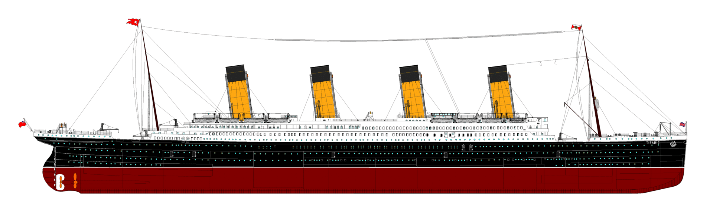
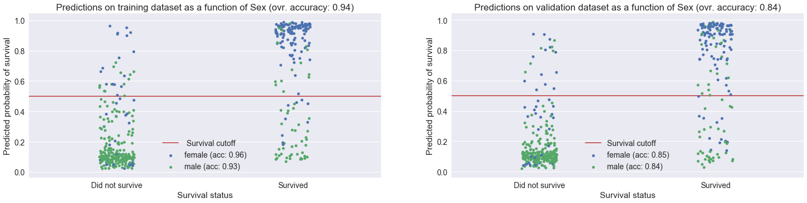
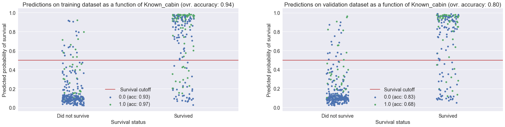

# Titanic: Machine Learning from Disaster

## Kaggle competition to predict survivors on the Titanic

  
  

### Introduction

This Python3 project is used to predict survivors on the Titanic using machine learning techniques based on training and testing data provided by Kaggle (https://www.kaggle.com/c/titanic).

### Description

The workflow for this project is the following:
- Importing train and test data files into pandas dataframes
- Feature engineering, including:
    - Merging both the train and test dataframes to detect common patterns
    - Creating dummy variables for categorical variables (Sex, Embarked)
    - Adding new features: 
        - the fraction of survivors among the group sharing the same ticket
        - the fraction of survivors among sibblings
        - checking if the cabin is known (double the survival rate for 2nd and 3rd class passengers)
        - binning age categories ("Missing", "Infant", "Child", "Teenager", "Young Adult" ,"Adult" ,"Senior" --> also not used as a feature because it is not better than age)
        - Use of publicly available deck maps of the Titanic to determine the location of passenger cabins, including:
           - Deck (A to F)
           - Position (forward, amidships or aft)
           - Ship side (port or starboard)
           - Distance to main staircases (near or far)
    - Filling "Age" column with best estimate data (not used because it leads to overfitting training data)
        - average age of siblings, or
        - average age of other passengers with same class and sex (if available)
    - Separating the train and test dataframes again
- Quick analysis of the performance of various machine learning algorithms (Logistic regression, K-nearest , Decision tree, Random forest, Gradient boosting, Support vector machine, Naive Bayes model accuracy)
    - The best performing algorithms are random forest and gradient boosting with cross validation score of around 82% +- 4% (95% confidence interval)
- Grid search for optimization of hyperparameters for both the random forest and gradient boosting algorithms
    - Leads to slight improvement in cross validation score (84% +- 4%) with possible risk for overfitting the training data
- Predictions using the best random forest model on the testing data provided by Kaggle with 80.8% accuracy (top  7% in Kaggle's Titanic competition)
- Stacked model of the best perfroming models (random forest, gradient boosting, neural network, logistic regression)

### Main results

The best algorithm (random forest with limited features) has obtained a 80.8% accuracy on Kaggle's Titanic survivors competition (top 7%). The maximum cross validation accuracy achieved using the data is 85.4% (using the optimized gradient boosting model). The minimum possible accuracy (obtained with the assumption that every passenger on board died) is around 68%.

Below is the confusion matrix for the training data (using cross-validation) for the model with the maximum . It shows that the accuracy (85.4%), predicted positive value (i.e. probability of survival if predicted survived, 86.1%) and predicted negative value (i.e. probability did not survived if predicted did not survive, 85.1%) are all similar. 

  

The chart below displays the survival probability predicted by the best model (optimized gradient boosting model) for the group of passengers that did and did not survive, with distinct colors for male and female passengers and for both the training and validation dataset. It shows that, despite overfitting by the model on the training data (see high accuracy values), the model is able to predict male and female survival rate with a similar accuracy.

The same chart for the "known cabin" feature (i.e. if the passenger's cabin is known in the dataset) shows that the accuracy for predicting survival of passengers with a known cabin is much lower than that of other passengers. This behavior is probably due to model overfit caused by the large number of features based on the cabin information and  low number of known passenger cabins.

This behavior may explain why the models with the highest CV accuracy did not lead to the highest leaderboard accurady.
